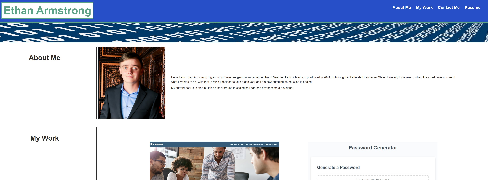

#  Scratch Challenge: Portfolio Page

##  Challenge Description

In this challenge, I was asked to build a portfolio page with basic information and work done.

**Acceptance Criteria:**

AS AN employer

I WANT to view a potential employee's deployed portfolio of work samples

SO THAT I can review samples of their work and assess whether they're a good candidate for an open position

**Usage Guide**
Click the deployed link and use its navigation to see current information and work done.

**My Link** https://duck0-land.github.io/myPortfolio/

**Repo Link** https://github.com/Duck0-Land/myPortfolio
